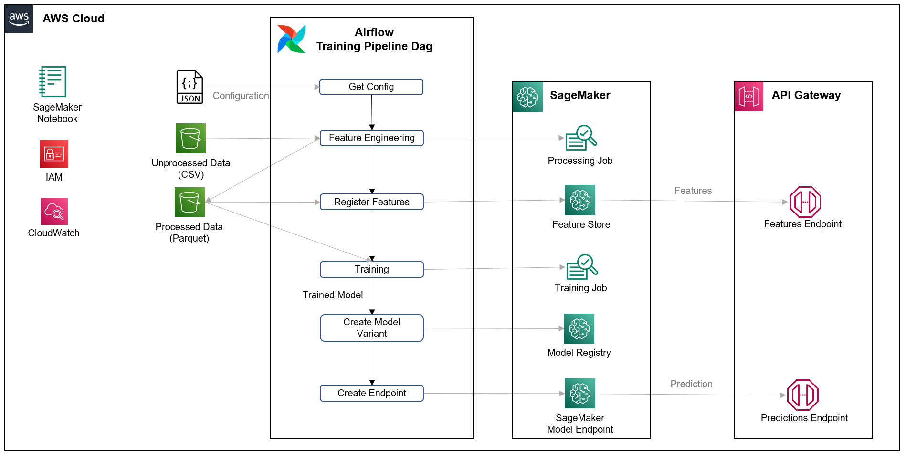
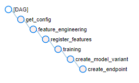

# Credit Default Risk
# Machine Learning Operationalization

## 1. Introduction
The main purpose of this project is to build an end-to-end data pipeline of a machine learning model. This includes:
- A scalable feature engineering stage
- A classification training model
- Availability of trained model and processed features through an API

 

## 2. Requirements
1. The "Credit Default Risk" dataset (source: Kaggle). The columns and theri description of the dataset are available at the end of this document.
2. A jupyter notebook containing code with some feature engineering and the training of a machine learning model.

 

## 3. Architecture

This project is builded in AWS Cloud. Below you can see an overall of the architecture:

**Main Components:**
- **Airflow** Orchestration of the training pipeline.
- **API Gateway**: API that makes model endpoint available.
- **SageMaker:** Used for processing jobs, training jobs and model endpoint to make predictions. It also uses Feature Store tool.
- **S3:** Used for saving dataset and code.

 

## 4. Training DAG

The training pipeline contains the following stages:
- **Get Config:** Retrieve the necessary configuration from a json file. This is used in all of the stages.
- **Feature Engineering:** Run a processing job in SageMaker to run feature engineering stage. It creates 5 features from the original dataset and store them in a parquet file. It also store 'id' and 'loan_date' columns. The algorithm is coded in PySpark. You can change the number of running nodes in the config.json.
- **Register Features:** The processed data is then registered in SageMaker Feature Store. It uses 'id' as the record key and 'loan_date' as the EventTime. This tool is used to make this feature available in an efficient way for the API.
- **Training:** Run a training job in SageMaker. Specifically, it trains a RandomForests classification algorithm.
- **Create Model Variant:** Registry the trained model in SageMaker. This is necessary for the next stage.
- **Create Endpoint:** Then, the trained model is made available on a SageMaker endpoint. Now, the model can be used for inferences.

 

## 5. API Endpoints

An API is builded in API Gateway to serve the features and use the trained model. Specifically, 2 endpoints are created:
1. **Get Features:** Given an id of a user, it returns the 5 features available on the Feature Store. The endpoint returns the record with the 5 features corresponding to the last loan made for the given user id. 
2. **Get Prediction:** Given an id of a user, it returns the prediction of credit risk using the model trained and available on the SageMaker endpoint. With the given user id, it makes a request to the get features endpoint and retrieves the features data.

 

## 6. Folder Structure
- **images:** Images used for this document.
- **notebooks:** Jupyter notebooks of the original feature_engineering and training stages.
- **src**:
    - **api:** Endpoints scripts and respective tests.
    - **dag:** Training pipeline, Airflow DAG.
    - **pipeline:** Scripts that are executed by the different SageMaker jobs: feature_engineering, training and inference (for model endpoint).

 

## 7. Potential Upgrades
So far, only a draft of the project has been made. It has room for improvement in different areas:
- Deployment: make a deployment of the different resources, for instance, using AWS Cloudformation.
- CI: Implement CI practices, for instance, using AWS CodePipeline.
- Tests: Implement new tests, for example, for the training dag.
- DAGs: Decouple the pipelines and implement new ones. For example:
    1. A training pipeline, where a model is trained, evaluated, validated and registrated.
    2. A release pipeline, where a trained model is deployed.
    3. A champion-challenger pipeline, which can compare the performance and take decitions of different models given some metrics.

 

## 8. Appendix
### Original Dataset

Columns:

- **loan_id**: loan number
- **id**: client number
- **code_gender**: gender
- **flag_own_car**: if users have a car
- **flag_own_realty**: is there a property
- **cnt_children**: number of children
- **amt_income_total**: annual income
- **name_income_type**: income category
- **name_education_type**: education level
- **name_family_status**: marital status
- **name_housing_type**: way of living
- **flag_mobil**: is there a mobile phone
- **flag_work_phone**: is there a work phone
- **flag_phone**: is there a phone
- **flag_email**: is there an email
- **occupation_type**: occupation
- **cnt_fam_members**: family size
- **status**: 0 means paid on time, 1 mean not paid on time
- **birthday**: birthday
- **job_start_date**: job start date
- **loan_date**: loan date
- **loan_amount**: loan amount

### Processed Dataset

- **id**: client number
- **nb_previous_loans**: number of loans granted to a given user, before the current loan
- **avg_amount_loans_previous**: average amount of loans granted to a user, before the current loan
- **age**: user age in years
- **years_on_the_job**: years the user has been in employment
- **flag_own_car**: flag that indicates if the user has his own car
- **status**: 0 means paid on time, 1 mean not paid on time. This is the **label** of the dataset